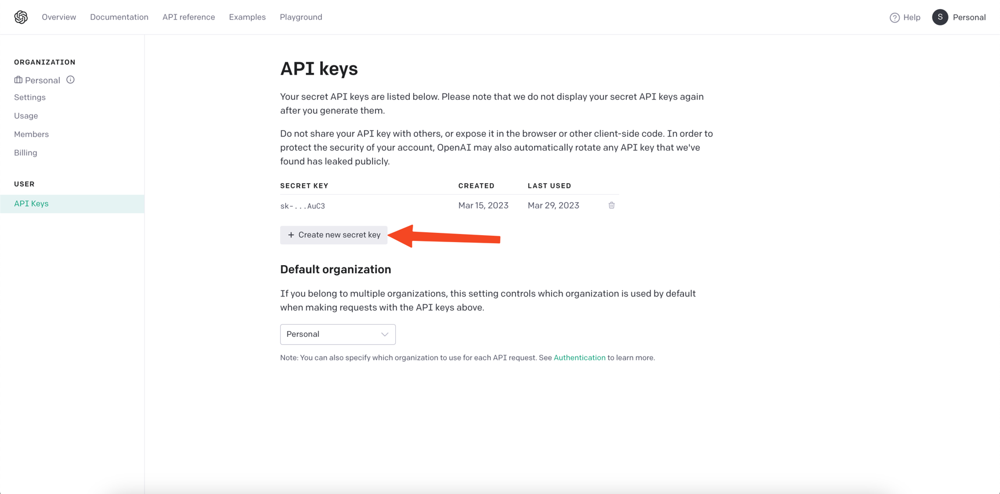

 

 

A pocket-sized GPT assistant that runs everywhere!

&nbsp; 
&nbsp;

See [Installation Guide](#installation-guide) for installing on desktop.

# Features

- Preset cards that quickly orient GPT to specific tasks for quick and easy use.
- Window is very flexible and can be configured to exist however you like on your system, including the system tray!
- Completely private and local, no data is transmitted to servers unless explicitly asked for.
- Natural and accessible UI that is easy to use and understand.
- Works on all major platforms, including Windows, MacOS, Linux, Android, iOS, and web!

## Supported Platforms

| Android | iOS | macOS | Windows | Linux | Web |
|---------|-----|-------|---------|-------|-----|
| ✅       | 🚧  | ✅     | ✅       | 🚧    | 🚧  |

### Disclaimer

> This is not a product of OpenAI. This is a utility app that uses OpenAI's services.

## Installation Guide

### MacOS

In order to install PocketGPT on MacOS, download the file named `PocketGPT-macos-x.x.x.dmg`.

#### Installing with DMG (Recommended)

1. To install PocketGPT in your Mac simply open `PocketGPT.dmg` and drag the PocketGPT.app to the `Applications` folder
   next to it. If you are updating the app you'll need to click `Replace`.
2. PocketGPT should now appear in your LaunchPad. However, if you try to open it you might get a message saying
   that `"PocketGPT" can't be opened because Apple cannot check it for malicious software.`
3. To fix this, open `System Preferences` and click on `Security and Privacy`.
4. you'll see a message saying `"PocketGPT" was blocked from use because it is not from an identified developer`.
5. Click on `Open Anyway` and then `Open` in the popup.
6. Done! You should now be able to use PocketGPT normally!

### Windows

#### Installing with MSIX (Recommended)

Download the `PocketGPT-windows-x.x.x.msix`.

## How to get an API key from OpenAI

You can navigate to your [account](https://platform.openai.com/account/api-keys) on [OpenAI][openai] to get your access
token. Make sure you're logged in!

## Build from source

1. Clone the repo
2. Install dependencies with `flutter pub get` or `derry deps`. They are identical.
3. Run app with `flutter run` on supported platforms.

## Socials

Website: 
Discord
Server: 
LinkedIn: 
Twitter: 

## Contributors

Thank you [Birju Vachhani](birju.dev) for being a key contributor to this project!

## Contribution

You are most welcome to contribute to this project!

[openai]: https://platform.openai.com/